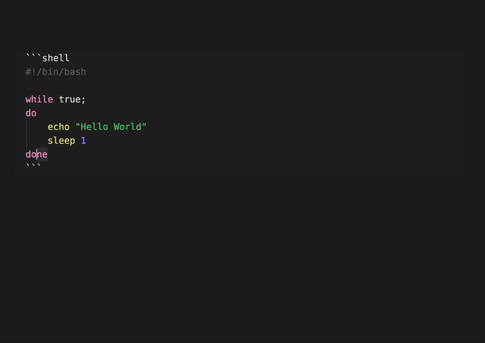

# AI Actions for Obsidian

A powerful Obsidian plugin that integrates AI-powered text processing directly into your note-taking workflow. Transform, enhance, and automate your writing with customizable AI actions.

## 📋 Changelog
For detailed changes, see [CHANGELOG.md](CHANGELOG.md).

## Demo

[SCREENSHOTS.md](docs/SCREENSHOTS.md)

## ✨ Key Features

### 🤖 Multi-Provider AI Support
- **OpenAI** - GPT models with custom API endpoints
- **Google Gemini** - All models with official SDK (streaming supported)
- **Ollama** - Local AI models for privacy
- **Groq** - High-speed inference
- **OpenRouter** - Access to multiple AI providers
- **LM Studio** - Local model hosting
- **Anthropic** - Claude models with official SDK

### ⚡ Pre-built Actions
- **Document Summarization** - Generate concise summaries
- **Text Completion** - Smart text continuation
- **Professional Rewriting** - Enhance tone and clarity
- **Hashtag Generation** - Auto-generate relevant tags
- **Task List Creation** - Convert notes to actionable items

### 🎯 Flexible Text Processing
- **Selection Options**: Process entire document or selected text
- **Output Locations**: Insert at beginning, append to end, replace selection, or save to specific files
- **Output Modes**: Choose different processing modes for prompt results
- **Custom Formatting**: Define output templates with placeholders
- **Temperature Control**: Adjust AI creativity and randomness
- **Token Limits**: Control response length

### 🛠️ Customization
- **Custom Actions**: Create unlimited personalized AI workflows
- **Provider Management**: Configure multiple AI providers with different models
- **Model Selection**: Choose specific models for each action

## 🚀 Installation

### From Obsidian Community Plugins
1. Open Obsidian Settings
2. Navigate to Community Plugins
3. Search for "AI Actions"
4. Install and enable the plugin

### Manual Installation
1. Download the latest release from [GitHub](https://github.com/ivan-mezentsev/obsidian-ai-actions/releases)
2. Extract to your vault's `.obsidian/plugins/ai-actions/` directory
3. Enable the plugin in Obsidian settings

## ⚙️ Configuration

### 1. Add AI Providers
1. Open plugin settings
2. Navigate to "AI Providers" section
3. Click "Add Provider"
4. Configure:
   - **Name**: Display name for the provider
   - **Type**: Select from supported providers
   - **API Key**: Your provider's API key
   - **URL**: API endpoint (auto-filled for most providers)

### 2. Configure Models
1. Go to "AI Models" section
2. Click "Add Model"
3. Set up:
   - **Name**: Display name for the model
   - **Provider**: Select configured provider
   - **Model Name**: Specific model identifier

### 3. Customize Actions
1. Navigate to "Custom Actions" section
2. Edit existing actions or create new ones
3. Configure:
   - **Name**: Action display name
   - **Prompt**: AI instruction template
   - **Model**: Selected AI model
   - **Selection**: Text input method
   - **Location**: Output placement
   - **Format**: Output template with `{{result}}` placeholder
   - **Temperature**: Creativity level (0.0-1.0)
   - **Max Tokens**: Response length limit

## 📝 Usage

### Quick Actions
1. Select text or position cursor
2. Open Command Palette (`Ctrl/Cmd + P`)
3. Search for AI action (e.g., "Summarize document")
4. Review output in preview modal
5. Accept or modify the result

### Custom Workflows
Create specialized actions for your needs:
- **Meeting Notes**: "Extract action items from meeting notes"
- **Research**: "Generate research questions from this topic"
- **Writing**: "Improve academic writing style"
- **Translation**: "Translate to [language]"

## 🔧 Advanced Features

### Template Variables
- `{{input}}` - Selected or document text
- `{{result}}` - AI-generated output

### Output Locations
- **Insert Head**: Beginning of document
- **Append Bottom**: End of document
- **Append Current**: After selection
- **Replace Current**: Replace selection
- **Append to File**: Specific file (e.g., Tasks.md)

### Development Mode
Enable advanced features:
- Extended configuration options
- Debug logging
- API call monitoring
- Custom provider testing

## 🔒 Privacy & Security

- **Local Processing**: Use Ollama or LM Studio for offline AI
- **API Key Security**: Keys stored locally in Obsidian
- **No Data Collection**: Plugin doesn't collect or transmit user data
- **Custom Endpoints**: Use self-hosted AI services

## 🤝 Contributing

Contributions are welcome! Please:
1. Fork the repository
2. Create a feature branch
3. Submit a pull request

For issues or feature requests, visit the [GitHub repository](https://github.com/ivan-mezentsev/obsidian-ai-actions).

## 📄 License

MIT License - see [LICENSE](LICENSE) file for details.

## 🙏 Credits

This plugin is a fork of [obsidian-ai-editor](https://github.com/buszk/obsidian-ai-editor) by [Zekun Shen](https://github.com/buszk). Special thanks to:

- **Zekun Shen (buszk)** - Original plugin architecture and implementation
- **Pavel Frankov** - LLM providers factory and prompt examples from [obsidian-ai-providers](https://github.com/pfrankov/obsidian-ai-providers)
- **Pavel Frankov** - spinnerPlugin from [obsidian-local-gpt](https://github.com/pfrankov/obsidian-local-gpt)
---

**Transform your Obsidian experience with AI-powered text processing!**
